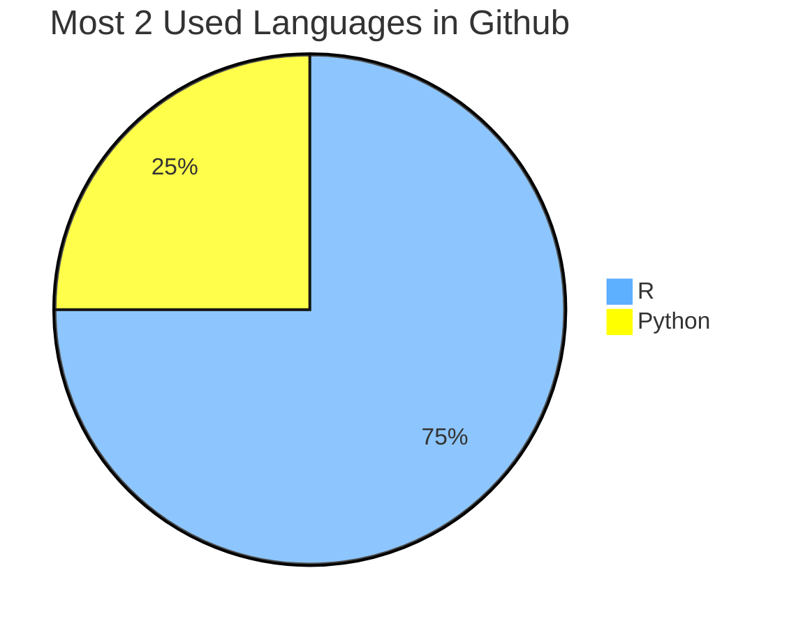

### Olá, me chamo Alessandro Pereira Torres 👋

- 📈 Graduado em estatística na UFRN
- 🎮 Criador de jogos digitais pelo IMD
- 🥉 Duas vezes medalhista de bronze na OBMEP
- 🖥  Entusiasta em Big Data, Machine Learning, Neural Networks e LLM
- 📊 Criador de Dashboards em Shiny/Streamlit/Power BI
- 💡    Sempre aprendendo coisas novas

### Pode me conhecer clicando em:

[][linkedin]
[][Yahoo]
[][Gmail]
[][Medium]
[][HF]
[][Sublime_Text]

 

### Linguagens e ferramentas:

[][R]
[][Python]
[][SublimeText]
[][Excel]
[][PowerBI]
[][Unity]
[][Git]
[][MySQL]
[][SQLServer]
[][PostgreSQL]

 

### Principais projetos
- [LLM Agents, Function Calling, Finetunning with FastAPI](https://medium.com/@alessandro.pereira.700/a-fast-tutorial-to-understand-agents-function-calling-finetunning-with-fastapi-2615d1f5ab00)
- [Improve lightweight LLMs for specific tasks](https://medium.com/@alessandro.pereira.700/improve-lightweight-llms-for-specific-tasks-in-low-resource-applications-6a48e620ee9d) ( [llama 3.2](https://alessandroptsn-llama3-2sql.hf.space/) / [qwen 2.5](https://alessandroptsn-qwen-2-5-sql.streamlit.app/) )
- [API para reconhecimento de emoções usando redes neurais](https://medium.com/@alessandro.pereira.700/deploy-neural-network-models-into-production-b8438843f224)
( [Vídeo apresentação 4 minutos](https://www.loom.com/share/4e4edb7bf6ed4b8bbbbe38a6a9cedf8f) )
- [API para previsão de pagamentos de empréstimos usando ML](https://medium.com/@alessandro.pereira.700/from-classic-models-to-production-models-8d4ab873ac4d)
- [Dashboard análise de dados SIRAG/COVID-19](https://alessandropereira.shinyapps.io/Painel-SIVEP-Gripe/)
- [Dashboard análise comparativa entre ativos](https://alessandropereira.shinyapps.io/Ativo_Ibovespa/)
- [Como calcular a idade do UNIVERSO](https://alessandroptsn.github.io/Como-calcular-a-idade-do-UNIVERSO/)
- [Dashboard COVID-19 Update](https://alessandropereira.shinyapps.io/Covid_Update/)
- [Classificador de Imagens com Machine Learning em R](https://alessandroptsn.github.io/Classificador-de-Imagens-R/)

<!--

 

### Principais repositórios:

| Classificador de imagens     | Skils |  Como calcular a idade do UNIVERSO | Skils     | 
|-----|---------------|------------|---------------|
|  [][Dog]  |  <li>Machine Learning</li> <li>Random Forest</li>   |  [][Galaxy]  |  <li>Linear Regression</li> <li>Big Data</li> | 
|<ul><li>-[x] R</li></ul>||<ul><li>-[x] Python</li></ul>||

| Coronavírus (COVID-19) | Skils |  Emotion Recognizer | Skils     | 
|-----|---------------|------------|---------------|
|  [][Covid]  |    <li>Web Scraping</li> <li>Dashboard</li> <li>Data Visualization</li>  |  [][Faces]  |  <li>Convolutional Neural Network</li> <li>API</li> <li>MLOps</li> | 
|<ul><li>-[x] R</li></ul>||<ul><li>-[x] Python</li></ul>||

!-->

 
 

[Faces]: https://medium.com/@alessandro.pereira.700/deploy-neural-network-models-into-production-b8438843f224
[Dog]: https://alessandroptsn.github.io/Classificador-de-Imagens-R/ 
<!--https://github.com/AlessandroPTSN/Classificador-de-Imagens-R!-->
[Covid]: https://alessandropereira.shinyapps.io/Covid_Update/ 
<!--https://github.com/AlessandroPTSN/Covid-19!-->
[Star]: https://alessandroptsn.github.io/Classificando-estrelas-com-Kmeans/ 
<!--https://github.com/AlessandroPTSN/Classificando-estrelas-com-Kmeans!-->
[Galaxy]: https://alessandroptsn.github.io/Como-calcular-a-idade-do-UNIVERSO/ 
<!--https://github.com/AlessandroPTSN/Como-calcular-a-idade-do-UNIVERSO!-->
[Sublime_Text]:https://medium.com/p/712a4473a3d9
[SublimeText]: https://www.sublimetext.com/
[MySQL]: https://www.mysql.com/
[SQLServer]: https://www.microsoft.com/pt-br/sql-server
[PostgreSQL]: https://www.postgresql.org/
[linkedin]: https://www.linkedin.com/in/alessandroptsn/
[R]: https://www.r-project.org
[Python]: https://www.python.org
[Excel]: https://www.microsoft.com/pt-br/microsoft-365/excel
[PowerBI]: https://www.microsoft.com/pt-br/power-platform/products/power-bi
[Unity]: https://unity.com
[Git]: https://git-scm.com/
[Yahoo]: mailto:alessandroptsn@yahoo.com.br
[Gmail]: mailto:alessandroptsn@gmail.com
[Medium]: https://medium.com/@alessandro.pereira.700
[HF]: https://huggingface.co/alessandroptsn
